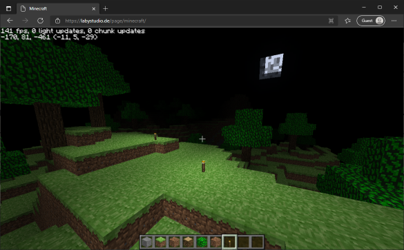

# Minecraft recode in JavaScript

This is a sandbox that provides all basic features of Minecraft. 
The main purpose of this project is to understand the render and physics engine of Minecraft. 
The source code was ported from the [java-minecraft](https://github.com/LabyStudio/java-minecraft) project.

 
Click [here](https://labystudio.de/page/minecraft/) for a demo!

### Feature Overview

Click here to expand feature list

- Block rendering
    - Biome color
- Block collision
- Player movement
    - Walking
    - Sprinting
    - Sneaking
    - Flying
    - Swimming
- Lightning
    - Dynamic lightning
    - Smooth lightning (Ambient occlusion)
    - Day/Night/Sunset
    - Sky color rendering
    - Block light source
- Entity Rendering
    - Item in hand
    - Arm swing animation
    - Walking animation
    - Crouch animation
    - Block break particles
- World
    - 16x16x16 Chunks
    - Block type, data, sky & block lightning
    - Entities
    - Minecraft Alpha Generator
      - 64 bits seed
      - Perlin terrain generation
      - Perlin cave generation
      - Perlin tree and big tree generation
- Camera
    - Frustum Culling
    - Fog
    - Underwater fog
    - Dynamic FOV
    - Third person
    - First person hand
    - First person item in hand
- GUI
    - Screens
      - Main Menu
      - Create World Screen
      - Loading Screen
      - InGame Menu
      - Options Screen
      - Controls Screen
      - Chat Input Screen
      - Creative Inventory Screen
      - Direct Connect Screen
      - Connecting Screen
      - Disconnected Screen
    - Widgets
      - Button
      - KeyBinding
      - Slider
      - Switches
      - TextField
    - Overlay
      - Cross-hair
      - Font rendering
      - Hot-Bar
      - Chat
      - Debug
      - Player list
- Multiplayer
    - Networking
      - RSA Encryption
      - AES Encryption
      - Compression
      - Splitting
      - NBT Serialization
      - Sub-Protocols
          - Handshake
          - Status
          - Login
          - Play
    - Packets
      - Chunk Packets
      - Movement Packets
      - Block Update Packets
      - Chat Packets
      - Player Packets
- Commands
    - /help
    - /time
    - /tp

# Screenshots
_Note: All textures from the original game were used for the screenshots only!_

### Licensing
- The main rendering library is [three.js](https://github.com/mrdoob/three.js/)
- 64 bits number implementation by [long.js](https://github.com/dcodeIO/long.js)
- AES encryption implemented by [aes-js](https://github.com/ricmoo/aes-js)
- BigInt extension for RSA encryption by [bigint-mod-arith](https://github.com/juanelas/bigint-mod-arith)
- Public key parser implemented by [asn1-parser.js](https://git.coolaj86.com/coolaj86/asn1-parser.js)
- Minecraft chat component parser by [mc-chat-format](https://github.com/janispritzkau/mc-chat-format)
- All used sound resources are taken from [freesounds.org](https://freesound.org/people/C418/downloaded_sounds/?page=8#sound)

NOT OFFICIAL MINECRAFT PRODUCT. NOT APPROVED BY OR ASSOCIATED WITH MOJANG.